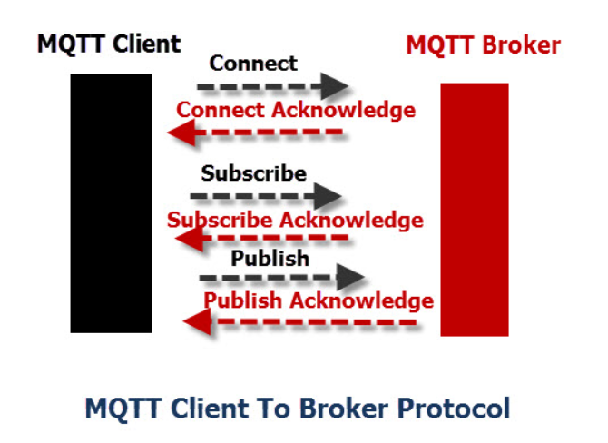

# Course Project - MQTT - Aayush Shah

This GitHub repository contains all the relevant code and dataset for '18-763 Systems and ToolChains for AI Engineers' course project.
The goal of the course project is to analyze the [MQTTset database](https://www.kaggle.com/datasets/cnrieiit/mqttset) and predict the type of attack using machine learning techniques.

## MQTT Protocol

MQTT is a protocol for communication between IoT devices. It was invented in 1999 for use in the oil and gas industry. Engineers needed a protocol for minimal bandwidth and minimal battery loss to monitor oil pipelines via satellite.
The MQTT protocol works on the principles of the publish/subscribe model as shown in the figure. 

## Dataset

The scenario for this dataset is related to a smart home environment where 8 sensors retrieve information about temperature, light, humidity, CO-Gas, motion, smoke, door and fan. The sensors send the data to a MQTT broker which is instantiated by using Eclipse Mosquitto, an open-source MQTT broker.
The data pertaining to message transmission between these is collated in CSV files for the training and testing. I have used the reduced version in this project - train70_reduced.csv and test30_reduced.csv. This indicates a 70-30 train-test split. 

## Features

There are 34 columns in the dataset. Following is a brief description of each along with their constraints. 

**Columns 1-3 define the TCP features upon which MQTT acts.** 

1.	tcp.flags: Flags associated with the TCP (Transmission Control Protocol) packet. Frequent two values: 0x00000018 and 0x00000010. 0x00000018 indicates that both the PSH and ACK flags are set in the TCP header whereas 0x00000010 depicts only ACK. Categorical value hence String type. 

2.	tcp.time_delta: Time delta or time difference between TCP packets. Constraint: Non-negative real values.

3.	tcp.len: Length of the TCP packet. Maximum in the dataset is 32768, which is half of the maximum TCP size of 65535. Constraint: Should always be less than 65535.

**Columns 4-7 specify Connect Acknowledgement part of the package. The connection between Client and Broker is set up through a connect-acknowledgement handshake. Clients initiate the connection by sending a CONNECT message to the MQTT broker. The broker confirms that a connection has been established by responding with a CONNACK message. Both the MQTT client and the broker require a TCP/IP stack to communicate.**

4.	mqtt.conack.flags: MQTT Connect Acknowledgment flags. This is full of zeros indicating a succesful connection. 

5.	mqtt.conack.flags.reserved: Reserved flags in MQTT Connect Acknowledgment. The value of this is always set to 0 in the dataset. 

6.	mqtt.conack.flags.sp: MQTT Connect Acknowledgment flags for Session Present. The value of this is also always set to 0 in the dataset.

7.	mqtt.conack.val: MQTT Connect Acknowledgment value. Constraint: should be between 0 to 5. Following is what each value depicts. 

0x00: Connection Accepted

0x01: Connection Refused, unacceptable protocol version

0x02: Connection Refused, identifier rejected

0x03: Connection Refused, server unavailable

0x04: Connection Refused, bad username or password

0x05: Connection Refused, not authorized

**Columns 8-15 contain various flags for different connection scenarios. They are binary variables (either 0 or 1) except mqtt.conflags, which is combined connect flags.**

8.	mqtt.conflag.cleansess: MQTT Connect flags for Clean Session. Constraint: 0 or 1. 

9.	mqtt.conflag.passwd: MQTT Connect flags for Password. Constraint: 0 or 1. 

10.	mqtt.conflag.qos: MQTT Connect flags for Quality of Service (QoS). Constraint: 0 or 1. 

11.	mqtt.conflag.reserved: Reserved flags in MQTT Connect. Constraint: 0 or 1. 

12.	mqtt.conflag.retain: MQTT Connect flags for Retain. Constraint: 0 or 1. 

13.	mqtt.conflag.uname: MQTT Connect flags for Username. Constraint: 0 or 1. 

14.	mqtt.conflag.willflag: MQTT Connect flags for Will Flag. Constraint: 0 or 1. 

15.	mqtt.conflags: Combined MQTT Connect flags of the above values.

16.	mqtt.dupflag: MQTT Duplicate Publish flag. Constraint 0 or 1. 

17.	mqtt.hdrflags: MQTT Header Flags.

18.	mqtt.kalive: MQTT Keep Alive value. Keep Alive in MQTT is a flag that defines a time interval in seconds during which a client shall notify an MQTT broker that the connection is alive.

19.	mqtt.len: Length of MQTT packets. Max value in the dataset is 692 but theoretical maximum length of MQTT packet is 256 MB. 

20.	mqtt.msg: MQTT message content.

21.	mqtt.msgid: MQTT Message ID.

22.	mqtt.msgtype: MQTT Message Type. Integer values representing MQTT Message Types (e.g., 1 for CONNECT, 2 for CONNACK). 

23.	mqtt.proto_len: Length of the MQTT Protocol Name. Basically it is 4 when protocol name is MQTT, since it has 4 letters. Most of the values are 0.

24.	mqtt.protoname: MQTT Protocol Name. It is either 0 or string 'MQTT'. This seems redundant hence can be dropped. 

25.	mqtt.qos: Quality of Service (QoS) for MQTT messages. Integer values representing MQTT Message Types (e.g., 1 for CONNECT, 2 for CONNACK). In this dataset it is either 0 or 1.

26.	mqtt.retain: MQTT Retain flag. Constraint: 0 or 1. 

27.	mqtt.sub.qos: MQTT Subscribe Quality of Service. All values are 0.

28.	mqtt.suback.qos: MQTT Subscribe Acknowledgment Quality of Service. All values are 0. 

29.	mqtt.ver: MQTT Protocol Version. Goes from 0 to 4. 

**Columns 30-33 specify the Will messages. This pertains to "Last Will and Testament" mechanism that allows an MQTT client to specify a message that the broker will publish on behalf of the client in the event of an unexpected or unclean client disconnection. It is a feature designed to handle scenarios where a client may disconnect abruptly or unexpectedly without sending a proper "DISCONNECT" message to the broker.
This scenario seems rare, hence all the values in these columns are 0.**

30.	mqtt.willmsg: MQTT Will Message.

31.	mqtt.willmsg_len: Length of the MQTT Will Message.

32.	mqtt.willtopic: MQTT Will Topic.

33.	mqtt.willtopic_len: Length of the MQTT Will Topic.

34.	target: The target, which is the type of attack in this case. The types of attack in the dataset are: legitimate, dos, bruteforce, malformed, slowite, flood.

50% of the values are legitimate, which means the network is not undergoing an attack and is legitimate. 
39% of the values are dos, indicating denial of service type of attack. 
11% are the rest. 

## Code
There are 4 code files in the form of Jupyter notebooks. The ones with 'Cloud' in their name are meant to be run on Google Cloud Platform and the rest are supposed to be run locally, preferrably through Anaconda. 
Requirements: Python 3.11, PySpark 3.4.1, Numpy 1.24.1, Pandas 2.0.3, Torch 2.1.0, Confluent-Kafka 2.2.0.

**Running local notebooks**

1) Download the files in the 'data' folder of the repository and replace the path in the 3rd cell while reading df_train and df_test to appropriate one.
2) Download pgAdmin4 and create a new server with schema named 'mqtt'. Download the JBDC jar executable and put in the bin folder of Spark home directory. Replace the data base properties according to the database you created.
3) If you have CUDA enabled PyTorch, run the rest of the cells as they are. Otherwise change the use_GPU variable to 'False' in all the instances of the 'train' function.
4) [Code walkthrough for Local notebooks](https://cmu.box.com/s/qwsjxt65hglwsgi83rdizea53u7rom5x)

**Running Cloud notebooks**

1) Transfer the files in the 'data' folder of the repository to a cloud storage bucket. Copy the path of the transferred files and paste then in the 2nd cell while reading df_train and df_test.
2) Download the postgres jar file and store it in the bucket. Replace the 'spark.jars' configuration with the location.
3) Create a Cloud SQL Postgres instance and allow all IP addresses by adding a network and putting 0.0.0.0/0 as the address. Replace the database properties dictionary with the new Cloud SQL properties. 
4) The remaining code should be run as it is.
5) [Code walkthrough for Cloud Notebooks](https://cmu.box.com/s/djm2t30rkckbqh7g8hw8ousa7bqltqqc)

## Methodology

### Spark

Model: Logistic Regression and Random Forest Classifier. 
I chose these models because I wanted to compare the performances of a probabilistic model compared to a decision tree based mode. Both models were trained first with their default parameters and five fold cross validation was conducted. 

**Hyperparameter Tuning**

* Logistic Regression: Regularization parameter and maximum number of iterations were chosen as tunable parameters. I wanted to see whether the model can fully converge by trying out different maximum iterations, and whether test accuracy can improve by reducing overfittig through regularization.
* Random Forests: Maximum depth of the tree and the maximum number of bins were chosen tunable parameters. The depth of the tree controls the representative power of the tree and overfitting, hence I wanted to observe how it affects the test accuracy. The bins control the number of partitions a continuous variable is divided into while splitting the tree. Since our data has continuous variables I decided to tune this parameter.

### PyTorch

Model: Feed forward neural network with depths 1 and 3.  
I wanted to compare the effect of depth of the architecture on the performance of the model. 
Model 1 has one hidden layer with 16 neurons, model 2 has 3 hidden layers with 16, 16, 8 neurons. Both have ReLU activations. Initially learning rate of 0.001 and batch size of 32 was used for benchmarking. Adam optimizer along with exponential learning rate scheduler was used with gamma = 1.  

**Hyperparameter Tuning**

Both models were tuned on learning rate and batch size hyperparameters, since the training process is most affected by these values. Learning rates from 0.1, 0.01, 0.001 and batch sizes from 32, 64, 128 was used. 

## Results and Discussions

### Spark
Before hyperparameter tuning, Logistic Regression had an accuracy of 82.04% on the test set and Random forest had accuracy of 82.08%.
After hyperparameter tuning logistic regression accuracy decreased, signifying that the chosen hyperparameters did not improve the model by much. However, Random forest accuracy increased significantly to 89.67% and is the better performing model out of the two. 

### PyTorch

Model 1 with depth 1 was having significant overfitting as can be seen in the training curve with validation loss continuously increasing. The test accuracy is 82.72%. After hyperparameter tuning the training curve improved and the validation losses stabilised, albeit did not decrease. However, the accuracy increased marginally to 82.73%.

Model 2 had an initial test accuracy of 82.74% with validation and train losses both decreasing. The accuracy plots were also increasing. 
After hyperparameter tuning the model did not improve much and the test accuracy remained around 82.74%, signifying that the chosen hyperparameters were not sufficient to improve the performance of a deeper model. However, the deeper model still performs better than the model with depth 1. 

## Conclusion

Out of all the models, Random forest classifier after hyperparameter tuning performed the best on test dataset with an accuracy of 89.67%. 

## References
The un-abbreviated name of each column was generated from ChatGPT after which further research was done from variety of sources to write the description and constraints:

1) https://aws.amazon.com/what-is/mqtt/
2) http://www.steves-internet-guide.com/mqttv5-connect-and-connack-messages-overview/
3) http://www.steves-internet-guide.com/mqtt-protocol-messages-overview/
4) https://www.emqx.com/en/blog/mqtt-5-0-control-packets-01-connect-connack

